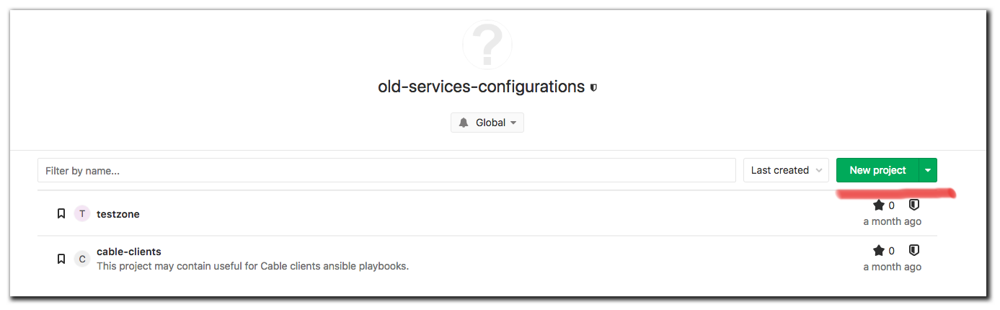
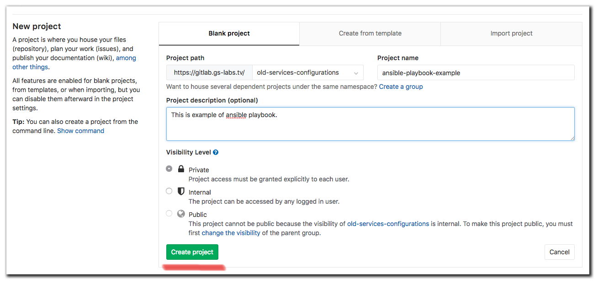
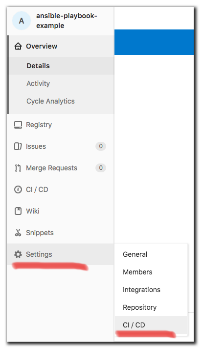
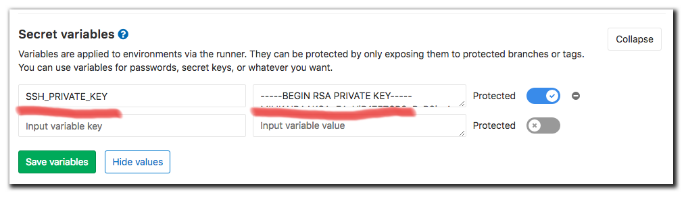
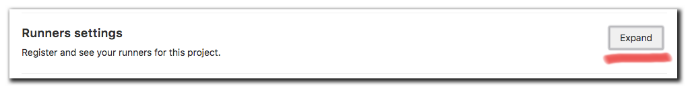
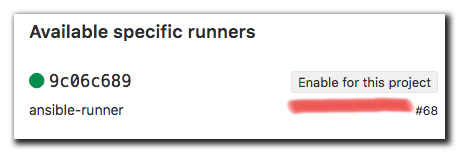
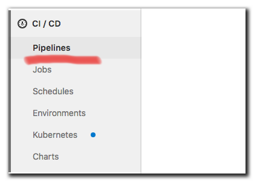
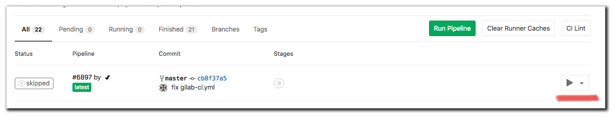

## Выполнение ролей Ansible на удаленных хостах

> Важно: Данная материал лишь объясняет общие схемы взаимодействия. Подразумевается, что пользователь знаком с продуктами, которые используются в данном тексте. 


Любое изменение конфигурации сервера с помощью Ansible подразумевает что у вас имеется:

1. Точка входа с Ansible:
    * SSH-Master key
2. Хосты, готовые к работе с Ansible:
    * Установленный python
    * Пользователь для подключения по SSH
    * SSH-Public key
3. Протестированная роль/плейбук

----

### Описание работы системы

Точкой входа является [Gitlab-CI](https://about.gitlab.com/features/gitlab-ci-cd/). Процесс запуска роли - соответствующий [pipeline](https://docs.gitlab.com/ee/ci/pipelines.html) на GitLab. SSH-Master key - хранится в [Secret Variables GitLab](https://docs.gitlab.com/ee/ci/variables/). При Запуске CI-процесса происходит поднятие docker-контейнера Ansible на [GitLab-Runner'е](https://docs.gitlab.com/runner/). В этот контейнер система прокидывает SSH-Master key, контейнер выполняет роль на хостах и завершает свою работу.

### Пример создания проекта/роли

#### 1. Создаём проект на GitLab



#### 2. Копируем SSH-ссылку на новый проект на GitLab

#### 3. Подготавливаем проект
###### - На рабочей машине клонируем репозиторий

```sh
root@debian:~$ git clone git@gitlab.gs-labs.tv:old-services-configurations/ansible-playbook-example.git
```

###### - Перейдём в директорию с новым склонированным локально проектом

```console
root@debian:~$ cd ansible-playbook-example
```

###### - Создаем два обязательных для Ansible файла:

```console
root@debian:~$ touch playbook.yml && touch inventory.yml
```

###### - Приводим `inventory.yml` к виду:

```yaml
linux-servers:
  hosts:
    192.168.152.32
  vars:
    ansible_user: root
```

###### - Приводим `playbook.yml` к виду:

```yaml
---
- hosts: linux-servers
  gather_facts: false
  vars:
    ansible_ssh_common_args: '-o StrictHostKeyChecking=no'
  roles:
    - role: linux-server-example-role
```

###### - Создадим минимальную структура для роли `linux-server-example-role`:

```console
root@debian:~$ mkdir roles
```

```console
root@debian:~$ mkdir roles/linux-server-example-role
```

```console
root@debian:~$ mkdir roles/linux-server-example-role/tasks
```

```console
root@debian:~$ touch roles/linux-server-example-role/tasks/main.yml
```

###### - Приводим `roles/linux-server-example-role/tasks/main.yml` к виду:

```yaml
---
- name: Example task
  ping:
```

###### - Создадим файл `.gitlab-ci.yml` в корне проекта:

```console
root@debian:~$ touch .gitlab-ci.yml
```

###### - Приводим его к виду:

```yaml
stages:
  - deploy

stage: deploy
when: manual
image: williamyeh/ansible:alpine3
before_script:
  - eval $(ssh-agent -s)
  - echo "$SSH_PRIVATE_KEY" | tr -d '\r' | ssh-add - > /dev/null
  - mkdir -p ~/.ssh
  - chmod 700 ~/.ssh
script:
  - 'ansible-playbook -i inventory.yml playbook.yml'
```

###### - В настройках проекта необходимо добавить в качестве Secret Variable SSH-Master key:
  - Переходим в настройки проекта

  

  - Добавляем ключ

  

###### - Подключаем GitLab-Runner к проекту




#### 4. При необходимости вносим изменения в роль/плейбук/inventory
#### 5. Пушим проект на gitlab:

```console
root@debian:~$ git add .
```

```console
root@debian:~$ git commit -m "initial commit"
```

```console
root@debian:~$ git push
```

#### 5. Запускаем pipeline:





#### 6. Видим результат выполнения в pipeline:

```
Running with gitlab-runner 11.0.0 (5396d320)
  on ansible-runner 9c06c689
Using Docker executor with image williamyeh/ansible:alpine3 ...
Pulling docker image williamyeh/ansible:alpine3 ...
Using docker image sha256:bc3a0a11ee3311e204ec08f416a18e7ab3b457ccdc083730bc5640b270f07bbc for williamyeh/ansible:alpine3 ...
Running on runner-9c06c689-project-1144-concurrent-0 via ubuntu...
Fetching changes...
HEAD is now at cb8f37a fix gilab-ci.yml
From https://gitlab.gs-labs.tv/old-services-configurations/ansible-playbook-example
   cb8f37a..a79953b  master     -> origin/master
Checking out a79953b3 as master...
Skipping Git submodules setup
$ eval $(ssh-agent -s)
Agent pid 9
$ echo "$SSH_PRIVATE_KEY" | tr -d '\r' | ssh-add - > /dev/null
Identity added: (stdin) ((stdin))
$ mkdir -p ~/.ssh
$ chmod 700 ~/.ssh
$ ansible-playbook -i inventory.yml playbook.yml

PLAY [linux-servers] ***********************************************************

TASK [linux-server-example-role : Example task] ********************************
ok: [192.168.152.32]

PLAY RECAP *********************************************************************
192.168.152.32             : ok=1    changed=0    unreachable=0    failed=0   

Job succeeded
```